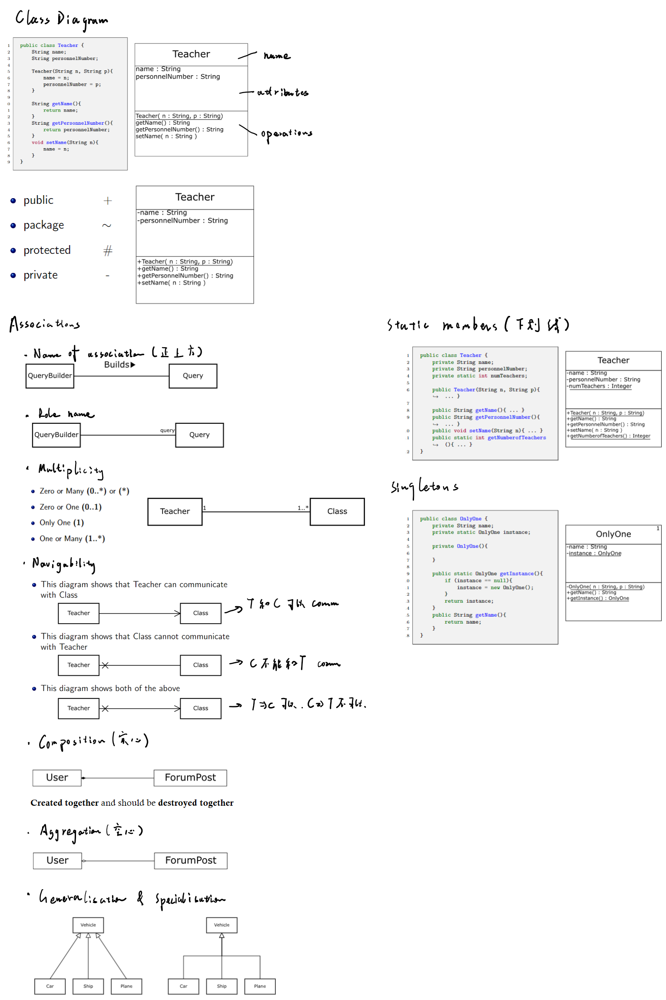

# 01-UML
## The Unified Modelling Language (UML)
Def: UML is the dominant modelling language in industry which efines a language for modelling systems.
### Type of UML
- **Class diagram**
- **Sequence diagram**
- **Use case diagram**
- **Object diagram**
- Collaboration diagram
- Statechart diagram
- Activity diagram
- Component diagram
- Deployment diagram

# 02-Processes
## Waterfall model

| Advantages | Disadvantages |
| ---------- | ------------- |
| Clear structure with milestones | Management of risk in projects |
| Documentation read for the next stage | Treatment of requirements |
### More disadvantages
- Planned testing is very late in the waterfall model
- If a large problem is discovered, we may need to return to analysis, design or coding and repeat a lot of work
- There is no limit to the cost of solving the problem

### Hard to gathering requirements 
1. The requirements of many systems are complex
2. Environment of the software may change during development
3. Involvement in the process can change the requirements

## Iterative and Incremental Development
### Iterative Development
- development is organised as a repeated completion of the development activities
### Incremental development
- Here the focus of the development is initially developing a prototype
- Then subsequent phases will add new functionality to the prototype or improve the existing functionality

### Compare and Contrast
- Compare: These two ideas are very compatible, both break development into iterations but have a different focus.
- Constrast: 
    - Iterative development is focused on the organisation of different activities
    - Incremental development is focused on what functionality is developed and when

## Unified Process
- UP includes activities such as requirements analysis,  analysis, design, implementation, and testing.
- UP assumes that models are important in software development

## Other
- Extreme Programming (XP) makelittle use of models
- XP does not recommend the use of models in the same way as UP
- XP is often thought of as being anti-model

## Use of UML in The Unified Process
### Domain model
- This is a very basic class diagram

# 02-Class Diagram

# 03-Other Diagrams

# 05-Requirements Analysis/Business Modelling
## Use case description
- Name
- Description
- Actors
- Triggers
- Preconditions
- Postconditions
- Courses of events
- Inclusions
- Data Outcomes

# 06-Analysis
>Analysis is the task of describing how interactingobject can perform the use cases.

**Target**: A big part of this is proving that the **task is possible**
We use a technique known as **realisation**

## Software Architecture Patterns
### Layered architecture
>Layered architectures are designed to help build stable designs.
>
>Key idea is **management of dependencies**

- The concept is to allocate different responsibilities to different subsystems

- Layers are represented by **packages** in UML and are shown as a tabbed folder
  - Upper layers can use lower layers
  - Lower layers are independent

### MVC pattern

- **Model** classes responsible for maintaining data
- **View** classes responsible for presenting data
- **Control** classes responsible for managing functionality

> Key idea is management of dependencies (again)

# 07-Principles

## S.O.L.I.D

- **S**ingle-responsibility Principle
- **O**pen-closed Principle
- **L**iskov substitution principle
- **I**nterface segregation principle
- **D**ependency Inversion principle

### **S**ingle-responsibility Principle

>A class should have one and only one reason to change, meaning that a class should have only one job. (一个类一个任务)

**Alternate Definition:**

> Gather together the things that change for the same reasons. Separate those things that change for different reasons.

If we follow this principle (**Desired result**):

- Changes to our system will require **only changes to parts of the code**
- Make your code much easier to **debug**, **test** and **maintain**

### Open-Close Principle

>Objects or entities should be **open** for extension, but **closed** for modification.

This principle is again concerned with the effects of **change** within a system.

|               | Open                                                   | Closed                                                       |
| ------------- | ------------------------------------------------------ | ------------------------------------------------------------ |
| **Condition** | If it is still available for extension                 | If it is not subject to further change                       |
| **Effect**    | This means **adding to or enlarging** its capabilities | It should **not change** and adversely affect the rest of the design |

### Liskov substitution principle

>Class S is correctly defined as a specialization of class T if the following is true: for each object s of class S there is an object t of class T such that the behaviour of any program P defined in terms of T is unchanged if s is substituted for t.

Less formally, this means that instances of a subclass can replace instances of a superclass without any effect on client classes or modules.

- All this is stating is that every subclass class should be substitutable for their parent class

- If a client holds a reference to an object of class T,then it will work equally well when provided with a reference to an object of class S

### Interface segregation principle

>A client should never be forced to implement an interface that it doesn’t use or clients shouldn’t be forced to depend on methods they do not use.

### Dependency Inversion Principle

>The general idea of this principle is as simple as it is important: High-level modules, which provide complex logic, should be easily reusable and unaffected by changes in low-level modules, which provide utility features. To achieve that, you need to introduce an abstraction that decouples the high-level and low-level modules from each other.

### No Concrete Superclass 

> All subclasses in generalization relationships should be concrete
>
> All non-leaf classes in a generalization hierarchy should be abstract

### Law of Demeter

> Each unit should have only **limited knowledge** about other units: only units ”closely” related to the current unit.

